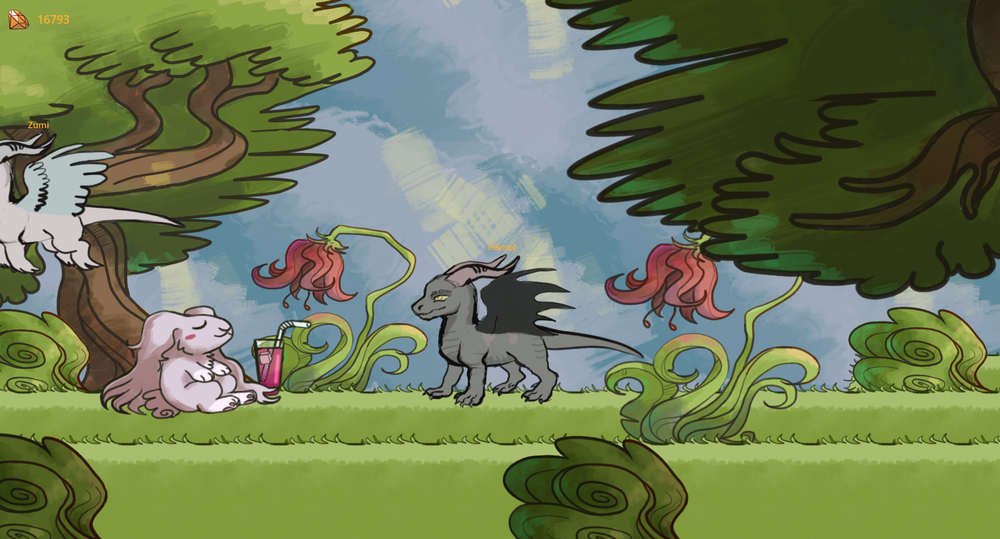

# Barvon - Multiplayer Game

A small 2D MMO game built with Godot where you play as a dragon. Explore the world, customize your character, and trade with other players.

## Features

- **Multiplayer**: Real-time multiplayer using ENet networking
- **Character Customization**: Customize your dragon's appearance (head, body, tail, wings, horns, eyes, and markings)
- **Trading System**: Buy items from merchants, soon - trade with other players
- **Persistent Data**: Character customization and items saved via backend API
- **Custom Assets**: All graphical assets used in the game are handmade by the developer and prone to rapid change and update

## Coming Soon

- Equippable items
- Battle mechanics with NPC enemies

## Work-in-Progress screenshots:

